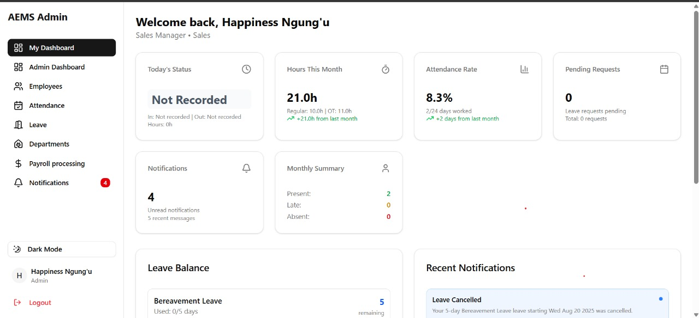

# 🚀 Automated Employee Management System  
*Efficient HR Operations & Payroll Processing*

---

## 🌐 Live Deployment  
The system is deployed on **Render.com**.  
> ⚡ **Note:** The server takes **2-3 minutes** to spin up after inactivity (Render puts free-tier apps to sleep after 15 minutes of no use).  

👉 [**Open the App**](https://employee-management-system-iblm.onrender.com/login)  

---

## 🔑 Demo Login Credentials  

### 👩‍💼 Admin Access  
- **Email:** `happiness@gmail.com`  
- **Password:** `qwerty`  

### 👨‍💻 Employee Access  
- **Email:** `lewis@gmail.com`  
- **Password:** `qwerty`  

or  

- **Email:** `irene@gmail.com`  
- **Password:** `qwerty`  


## 🛠️ Tech Stack  
- **Frontend:** React 
- **Backend:** Node.js / Express.js  
- **Database:** MongoDB  
- **Deployment:** Render.com  

---

## 📸 Demo Screenshot   


---

## 👨‍🏫 How to Use Locally  
1. Clone the repository:  
   ```bash
   git clone https://github.com/Nelson2023-2024/employee-management-system.git
   cd employee-management-system

2. change directory into backend install dependencies using npm i and run the app using npm run dev
    ```bash
    cd backend
    npm i
    npm run dev

3. change directory into frontend install dependencies using npm i and run the app using npm run dev
    ```bash
    cd frontend
    npm i
    npm run dev
